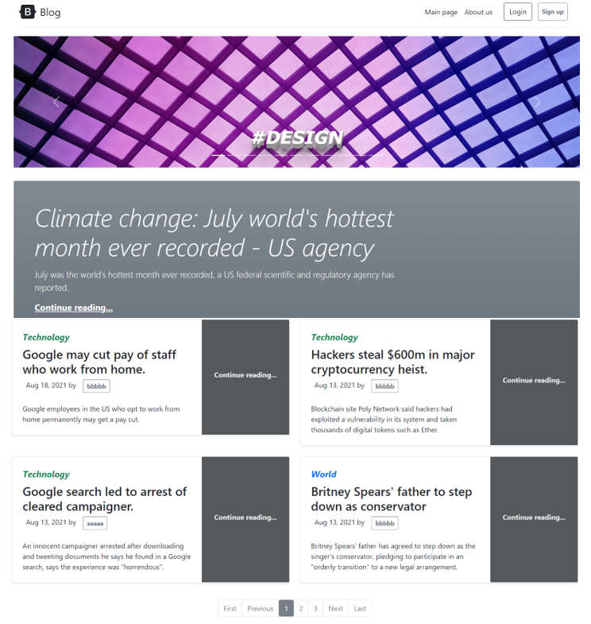
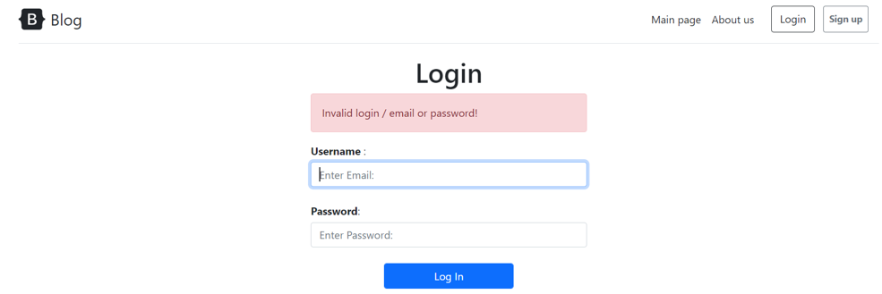
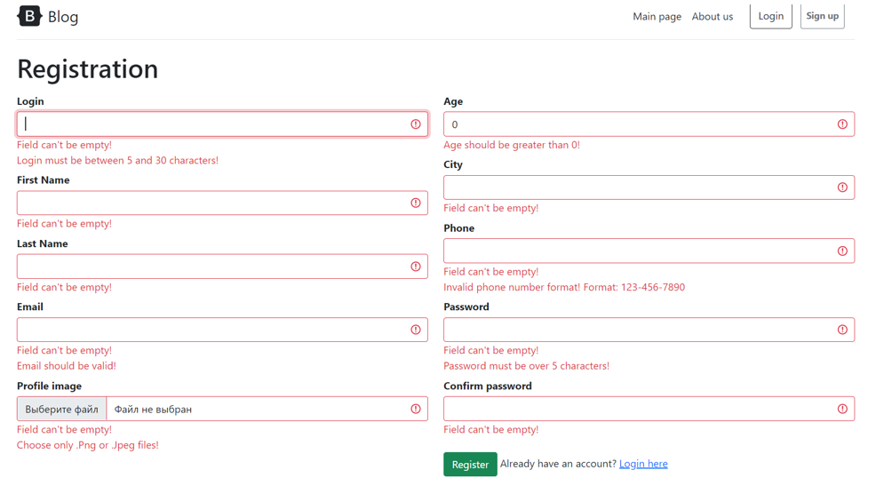
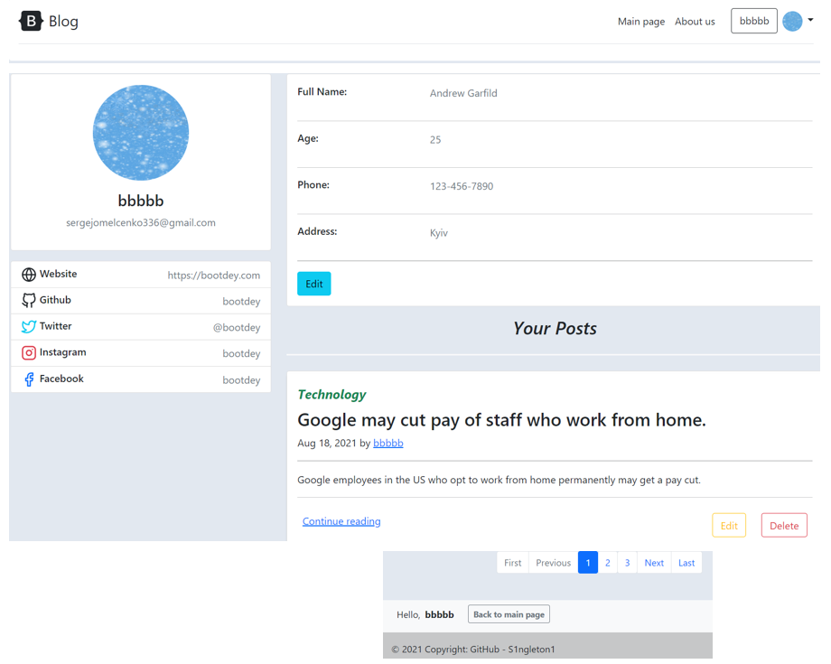
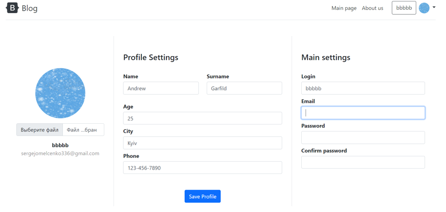
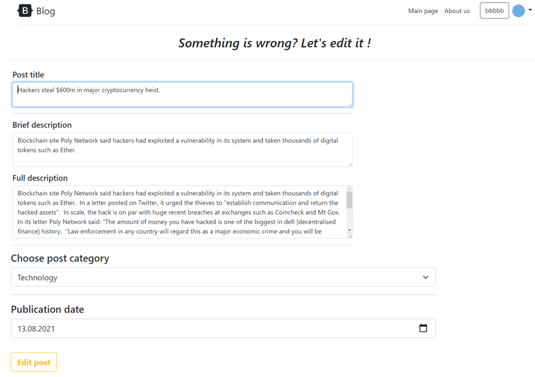
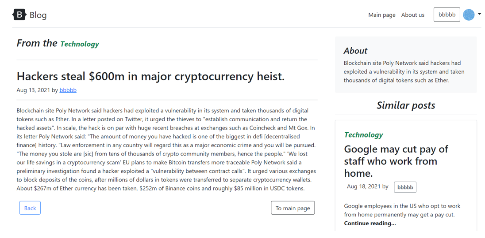
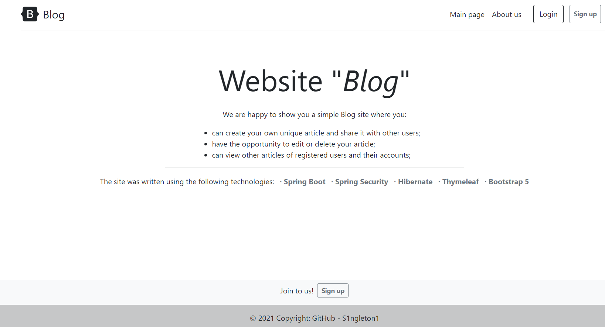

Simple application "Blog" that allows you to view all the articles that have been created by users of the site. It is possible to log in and register on the site, view your profile, create / view an article, edit them. You can also view the profiles of other users of the site and their articles. 
Technologies used: Spring Boot + Spring Security + Hibernate + Thymeleaf + Bootstrap 5.

